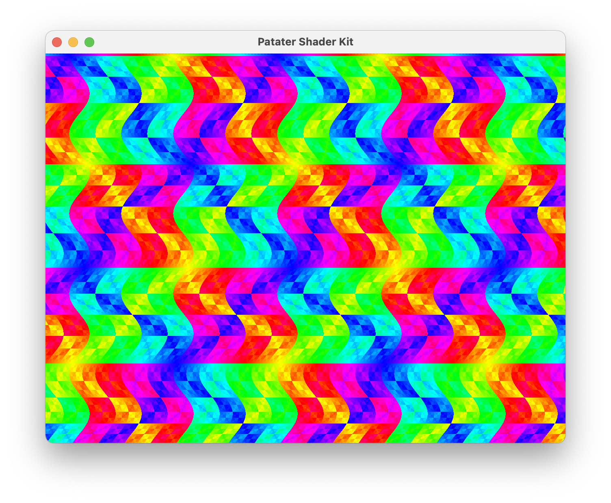

# The Patater Shader Kit

This program sets up an OpenGL 4.1 context (the latest supported on macOS) and
two triangles (in one triangle strip), from which [you can render the
world](https://www.iquilezles.org/www/material/nvscene2008/rwwtt.pdf) using a
fragment shader.

### Screenshots

[](https://www.youtube.com/watch?v=DpCmwxbaB1A)

### Fragment Shader Context

Each fragment shader run by the kit is provided a set of uniforms. This
information can be helpful to you in writing your own fragment shaders to run
with the kit.

- `resolution`
    - This is the resolution of the view port in pixels (more pixels with high
      DPI). It can be useful for keeping your drawing a consistent size or
      aspect ratio across differently sized viewports.
- `mouse`
    - The coordinates of the mouse cursor. This can be useful for making
      interactive drawings, responding to mouse cursor position or movement.
- `time`
    - The amount of time in seconds that the program has been running. This is
      useful when making animations independent of the actual frame rate.
- `frame`
    - The number of frames rendered so far. Like `time`, this can also be used
      to make animations, but unlike `time`, animations will slow down with
      lower frame rates.

### Pre-requisites

- [CMake](https://cmake.org/)
- [Ninja](https://ninja-build.org/)
- [SDL 2](https://www.libsdl.org/)
- A compatible OpenGL 4.1 capable Client Driver

### Cloning

This project uses git submodules, so don't forget to `git submodule update
--init` if you didn't clone this repo with `git clone --recurse-submodules`.

### Building

```
$ cmake -S . -B build -DENABLE_SANITIZERS=1 -DENABLE_WARNINGS=1 -GNinja
```

### Running

Use the provided demo fragment shader, or supply your own fragment shader.

```
$ ./build/src/shaderkit ./shaders/fragment.frag
```

### Testing

The kit has so far been tested on macOS 12 with the Apple M1 Metal renderer.
